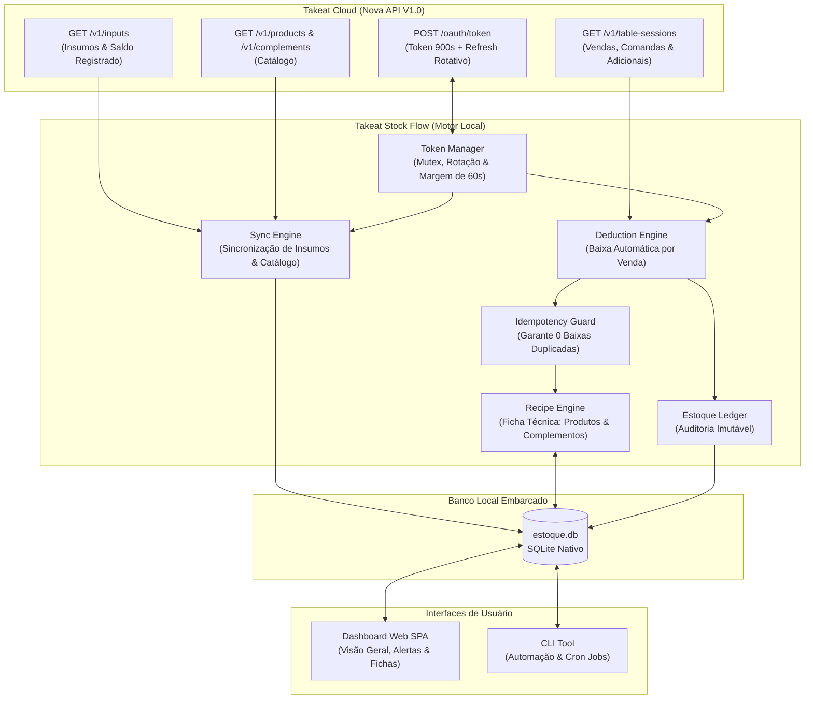

# 📦 Takeat Stock Flow

<div align="center">


<p align="center">
  <strong>Sistema profissional de gestão de estoque de bebidas e insumos com motor de ficha técnica (BOM) e rastreamento automático de vendas integrado à Nova API V1.0 da Takeat.</strong>
</p>

</div>

---

## 🎯 Visão Geral

Restaurantes e bares enfrentam o desafio constante de conciliar o cardápio e os pedidos vendidos com a baixa real do estoque. Itens compostos (ex.: *Caipirinhas*, *Drinks*, *Hambúrgueres Artesanais*) e adicionais pagos (ex.: *Dose Extra de Vodka*, *Bacon Fatiado Extra*, *Queijo Adicional*) consomem quantidades fracionadas de insumos diferentes a cada venda.

O **Takeat Stock Flow** resolve essa dor:
1. **Importa e monitora seu catálogo e insumos** diretamente da [Nova API V1.0 da Takeat](https://docs.takeat.app).
2. Permite cadastrar **Fichas Técnicas Visuais** tanto para **Produtos** quanto para **Complementos / Adicionais**.
3. Rastreia as comandas e vendas finalizadas (`/v1/table-sessions`), calcula o consumo exato em cada fração (gramas, mililitros, unidades) e dá **baixa automática no estoque**.
4. Mantém um **Ledger Imutável de Auditoria**, permitindo saber exatamente qual pedido de qual comanda/mesa baixou cada item.
5. Emite **alertas visuais de reposição** antes que seus insumos ou bebidas atinjam a ruptura.

---

## 🏗️ Arquitetura do Sistema



---

## ✨ Principais Funcionalidades

### 1. Motor de Ficha Técnica Completo (BOM - Bill of Materials)
* **Ficha Técnica de Produtos**: Associe múltiplos insumos por produto (ex.: Caipirinha = 60ml Cachaça + 1 Limão + 25g Açúcar).
* **Ficha Técnica de Complementos**: Rastreie adicionais e opções de personalização (ex.: Adicional de Bacon = 50g Bacon; Dose Extra = 50ml Vodka).
* **Conversão Automática de Unidades**: Se o estoque é controlado em Quilos ($kg$) e a receita consome Gramas ($g$), ou Litros ($L$) e Mililitros ($ml$), o sistema converte com precisão decimal ($1kg = 1000g$, $1L = 1000ml$).

### 2. Rastreamento e Baixa Automática de Vendas Takeat
* Consome `GET /v1/table-sessions` da Takeat no formato oficial UTC.
* **Garantia de Idempotência Estrita**: Cada `order_id` processado é registrado individualmente, impedindo baixas duplicadas caso a rotina seja executada mais de uma vez.
* **Tratamento de Cancelamentos**: Pedidos cancelados (`canceled_at` ou status `canceled`) são ignorados e não afetam o estoque.

### 3. Gestão de Bebidas & Insumos Críticos
* Monitoramento de saldo atual vs. estoque mínimo.
* Alertas visuais destacados no painel quando um item atinge o nível de segurança.
* Ajustes manuais com registro de motivo (Entrada/Compra, Inventário, Perda/Desperdício).

### 4. Zero Dependências Pesadas (100% Nativo)
* Desenvolvido para **Node.js v22+** aproveitando o suporte nativo a:
  * TypeScript nativo (`--experimental-strip-types`) sem transpilador externo.
  * Banco de dados SQLite embarcado (`node:sqlite`).
  * Suíte de testes nativa (`node:test`).
  * Cliente HTTP nativo (`fetch`).

---

## 🚀 Como Começar

### Pré-requisitos
* **Node.js** v22.0.0 ou superior (testado e homologado no Node 24).
* Conta de restaurante ou parceiro no [Takeat](https://takeat.app).

### 1. Clonar o Repositório
```bash
git clone https://github.com/seu-usuario/takeat-stock-flow.git
cd takeat-stock-flow
```

### 2. Configurar as Variáveis de Ambiente
Copie o arquivo de exemplo e crie o seu `.env`:
```bash
cp .env.example .env
```

Edite o arquivo `.env` com suas credenciais:
```ini
# Sua chave gerada no Takeat AI Builders (https://ai-builders.takeat.app)
TAKEAT_API_KEY=tk_live_sua_chave_aqui

# URL da Nova API Takeat
TAKEAT_API_URL=https://public-api.takeat.app

# ID do restaurante (apenas se for chave multi-restaurante de parceiro)
TAKEAT_RESTAURANT_ID=

# Porta do Servidor e Banco de Dados
PORT=3000
DATABASE_PATH=./data/estoque.db
AUTO_TRACK_INTERVAL_MINUTES=5
```

> [!IMPORTANT]
> **Como obter sua API Key:**
> 1. Acesse o portal oficial [Takeat AI Builders](https://ai-builders.takeat.app).
> 2. Crie uma nova chave concedendo os escopos: `inputs:read`, `products:read`, `complements:read` e `table-sessions:read`.
> 3. Guarde sua chave em segurança. **Nunca a exponha publicamente ou faça commit no Git.**

### 3. Iniciar o Painel Web
```bash
npm start
```
Acesse no seu navegador: **`http://localhost:3000`**

---

## 🧪 Modo de Demonstração (Teste Imediato sem API Key)

Quer testar a aplicação imediatamente antes de configurar a chave da Takeat?
Basta rodar:
```bash
npm run seed
npm start
```
Ou, dentro do Dashboard web, clicar no botão **"Dados Demo"** no canto superior direito.
Isso criará automaticamente insumos realistas (cervejas, cachaça, gin, carnes, pães, bacon, queijo), produtos, fichas técnicas de drinks e hambúrgueres, e simulará comandas Takeat já deduzindo os insumos no painel!

---

## 🛠️ Comandos da CLI

Além do Dashboard Web, o sistema inclui uma CLI para terminal e agendamentos (cron):

```bash
# Exibir o status atual do estoque e alertas críticos
npm run cli status

# Sincronizar catálogo de produtos e insumos com a Takeat
npm run cli sync

# Rastrear vendas das últimas 24h e aplicar deduções de estoque
npm run cli track

# Carregar dados de demonstração
npm run seed
```

---

## 🧪 Testes Automatizados

O projeto conta com testes unitários cobrindo o motor de cálculo, conversão de unidades, idempotência de vendas, cancelamentos e expiração de tokens:

```bash
npm test
```

Saída esperada:
```text
✔ DeductionService: Baixa de insumos por produto e complementos com conversão de unidades
✔ DeductionService: Pedidos cancelados não baixam estoque
✔ DeductionService: Dispara alerta quando atinge o estoque mínimo
✔ TakeatClient: Persistência e cálculo de expiração com margem de segurança de 60s
✔ TakeatClient: Lança erro amigável se TAKEAT_API_KEY não estiver definida
ℹ tests 5 | pass 5 | fail 0
```

---

## 📁 Estrutura de Pastas

```text
takeat-stock-flow/
├── data/                      # Armazenamento do banco SQLite (ignorado no Git)
├── src/
│   ├── db/
│   │   ├── schema.ts          # Definição das tabelas, índices e constraints SQLite
│   │   └── database.ts        # Camada DAO (consultas, ledger e transações)
│   ├── takeat/
│   │   └── client.ts          # Cliente oficial Takeat API V1.0 (OAuth, rotação e dados)
│   ├── services/
│   │   ├── sync.ts            # Sincronizador de catálogo e insumos da Takeat
│   │   ├── deduction.ts       # Motor de baixa automática e fichas técnicas (BOM)
│   │   └── seed.ts            # Gerador de dados de demonstração
│   ├── types/
│   │   └── index.ts           # Interfaces e tipos TypeScript do domínio
│   ├── web/
│   │   ├── public/
│   │   │   └── index.html     # Dashboard SPA responsivo (Tailwind CSS + Lucide)
│   │   └── server.ts          # Servidor HTTP nativo e API REST local
│   ├── cli.ts                 # Interface de linha de comando (CLI)
│   └── index.ts               # Ponto de entrada da aplicação
├── tests/
│   ├── deduction.test.ts      # Testes de baixa de insumos, receitas e idempotência
│   └── token.test.ts          # Testes de expiração e ciclo de vida OAuth
├── .env.example               # Template documentado de variáveis de ambiente
├── .gitignore                 # Proteção de credenciais, banco local e logs
├── package.json               # Configurações do projeto e scripts
├── tsconfig.json              # Configurações TypeScript modernas para ESM
└── README.md                  # Documentação completa do projeto
```

---

## 🔒 Boas Práticas de Segurança Takeat

* **Credenciais no Backend**: Chaves `tk_live_...` e `tk_test_...` operam exclusivamente no servidor local e nunca são enviadas ao navegador.
* **Ciclo de Vida do Token**: O `access_token` tem validade oficial de **900 segundos (15 minutos)**. O cliente renova automaticamente a cada ~14 minutos usando o `refresh_token` rotativo de uso único.
* **Coordenação Concorrente**: O cliente implementa mutex em memória para evitar que requisições paralelas consumam o mesmo `refresh_token` simultaneamente.
* **Respeito aos Rate Limits**: Aplica tratamento automático com backoff exponencial para respostas HTTP 429 (limite padrão de 10 requisições por minuto).

---

## 📄 Licença

Distribuído sob a licença **MIT**. Consulte `LICENSE` para mais informações.
